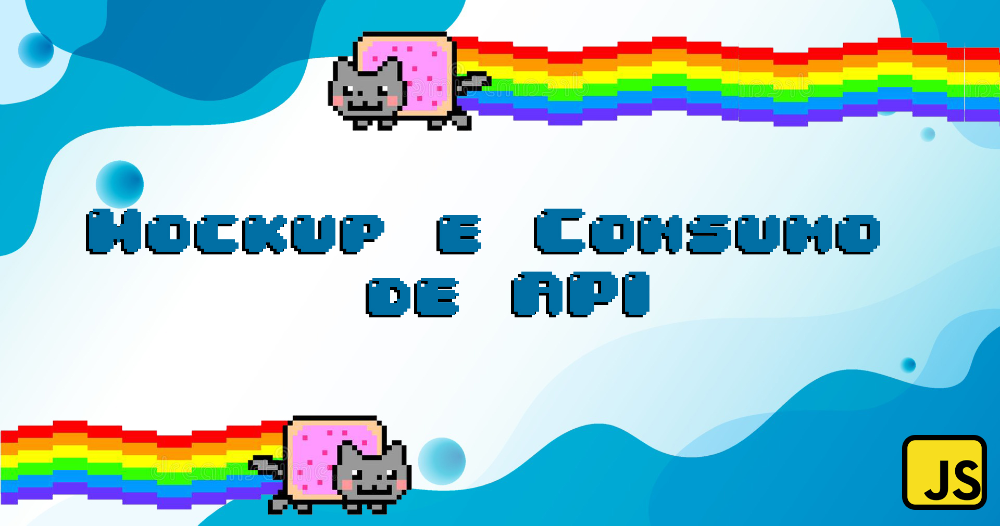
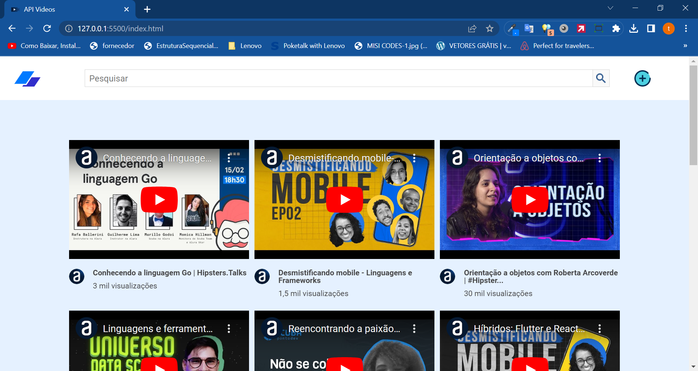
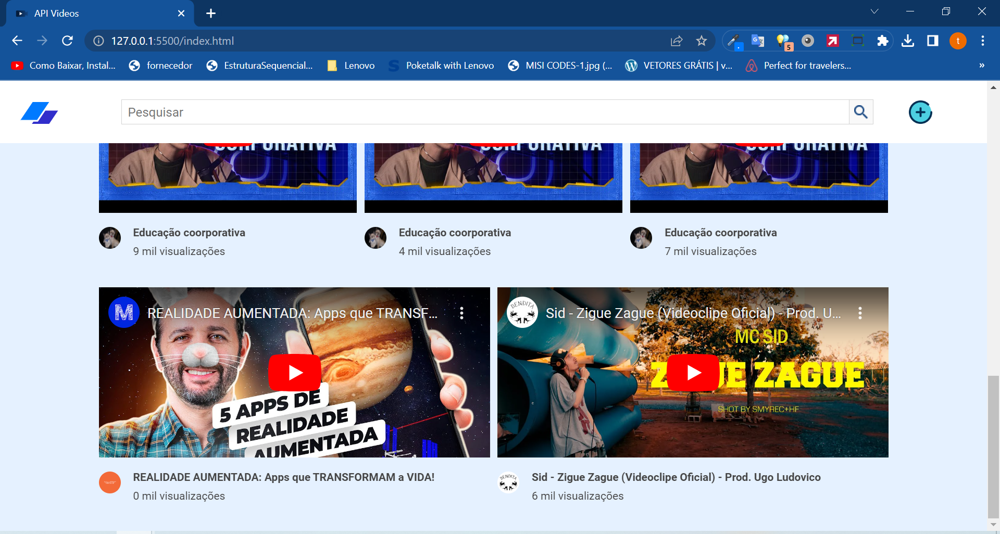
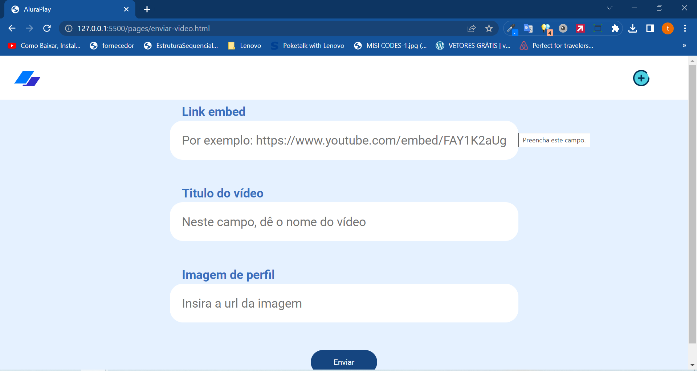
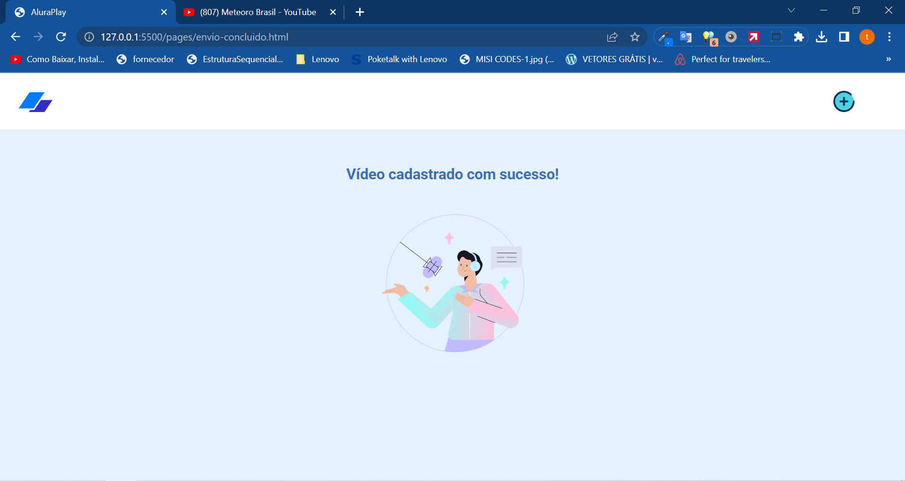
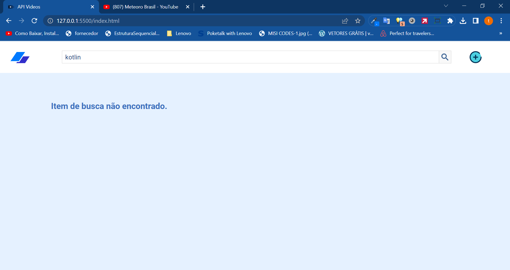
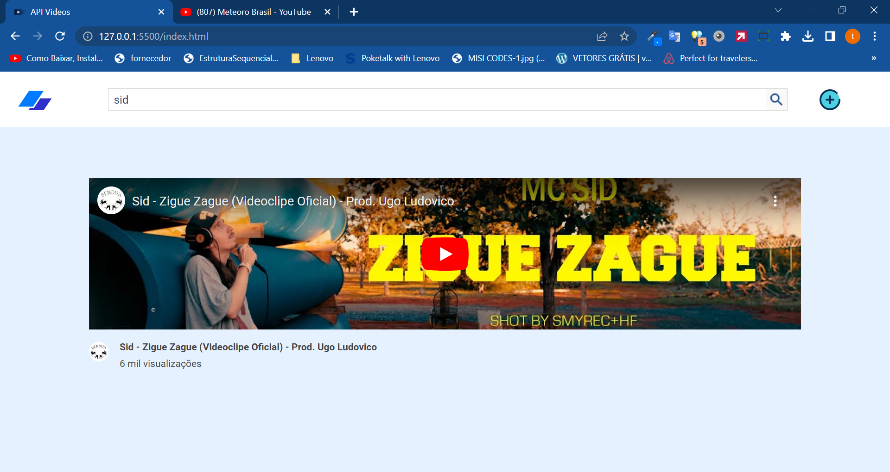

  

 Metodos de consulta e post em uma API 

Página inicial e formulário de cadastro de vídeos, uma plataforma de compartilhamento de vídeos.

## Tecnologias utilizadas durante o curso
* Javascript
* NodeJS
* Json-server

## Tecnologias utilizadas no projeto
* HTML
* CSS

## Screenshots

